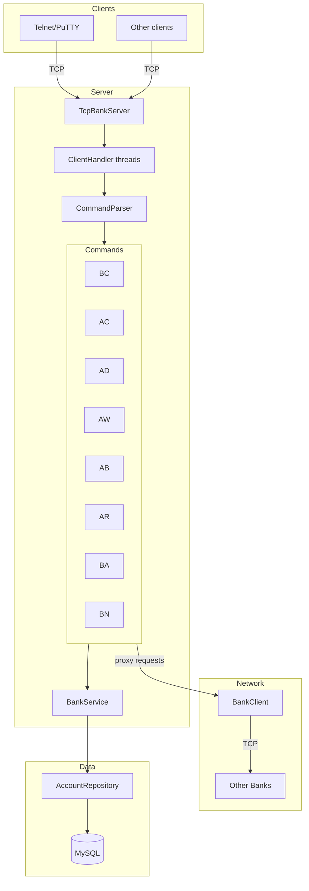
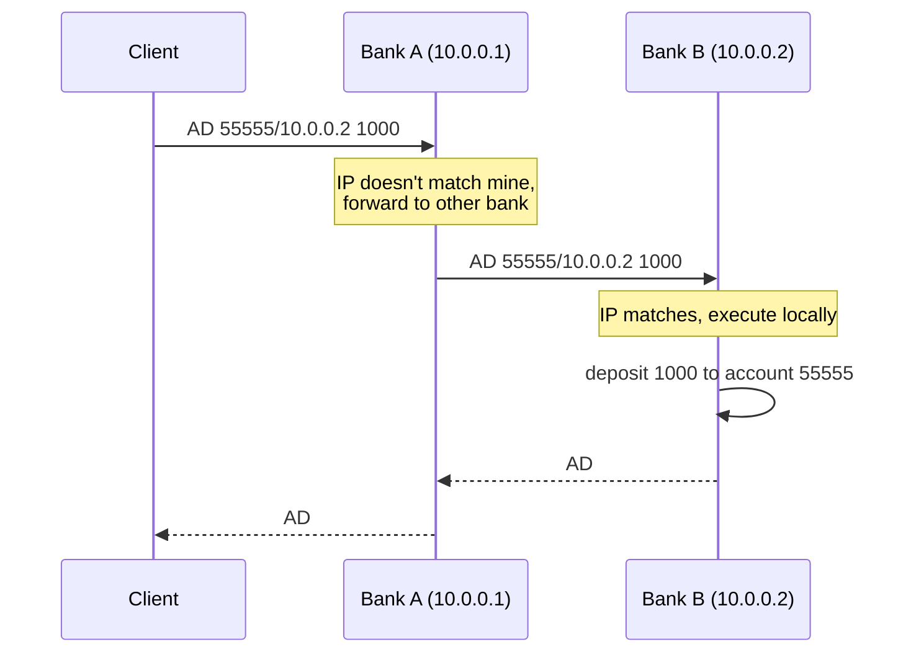
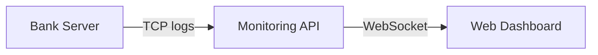

# P2P Bank

TCP banking server for school networking assignment. Banks can talk to eachother (thats the p2p part).

## How it works



## Proxy feature

If you deposit/withdraw/check balance on an account from another bank, the request gets forwarded automaticaly.



## Commands

| Command | What | Response |
|---------|------|----------|
| `BC` | bank IP | `BC 192.168.1.5` |
| `AC` | create account | `AC 12345/192.168.1.5` |
| `AD acc/ip amount` | deposit | `AD` |
| `AW acc/ip amount` | withdraw | `AW` |
| `AB acc/ip` | balance | `AB 5000` |
| `AR acc/ip` | delete account | `AR` |
| `BA` | total in bank | `BA 50000` |
| `BN` | num of accounts | `BN 3` |

Errors: `ER <message>`

## Setup

Need .NET 8 and MySQL.

1. Create the database:
```sql
CREATE DATABASE p2p_bank;
```

2. Copy the example env file and fill in your db credentials:
```bash
cd BankServer
cp .env.example .env
```

3. Edit `.env` with your mysql password and stuff

4. Run from the BankServer folder (important, thats where .env is):
```bash
cd BankServer
dotnet run
```

Tables get created on startup automatically.

## Test

```bash
telnet localhost 65525
BC
AC
AD 12345/192.168.1.5 1000
AB 12345/192.168.1.5
```

## Config args

- `--port` - tcp port (default 65525)
- `--timeout` - connection timeout ms (default 30000)
- `--ip` - override auto-detected IP
- `--db-server`, `--db-port`, `--db-name`, `--db-user`, `--db-pass`

## Notes

- Account numbers: 10000-99999
- Amounts: 0 to 9223372036854775807
- One thread per client
- Data persists in MySQL

## Monitoring

Theres a web dashboard for watching logs in real time. Its two parts - an API and a React frontend.

### How it works

The bank server has special commands for monitoring:
- `LISTENER` - turns the connection into a log stream (server pushes logs to you)
- `SHUTDOWN` - stops the bank server remotely

The API connects to the bank, sends LISTENER, and streams the logs over websocket to the frontend.



### Running the monitoring

1. Start the bank server first (see Setup above)

2. Start the API:
```bash
cd MonitoringWebApi
dotnet run
```

3. Start the web client:
```bash
cd MonitoringWebClient
npm install
npm run dev
```

4. Open http://localhost:5173 in browser

The API has these endpoints:
- `GET /log` - websocket endpoint for log streaming
- `GET /shutdown` - stops the bank server

## Reused Code

Database connection and repository pattern reused from previous project:
- `DbConnection.cs` - connection handling based on [kanban_db](https://github.com/riveerxd/kanban_db)
- `AccountRepository.cs` - CRUD operations pattern from [kanban_db](https://github.com/riveerxd/kanban_db)
- Compression - Compression abstraction system from [jtar](https://github.com/koubekj1/portfolio/tree/main/jtar)
---

school project btw
