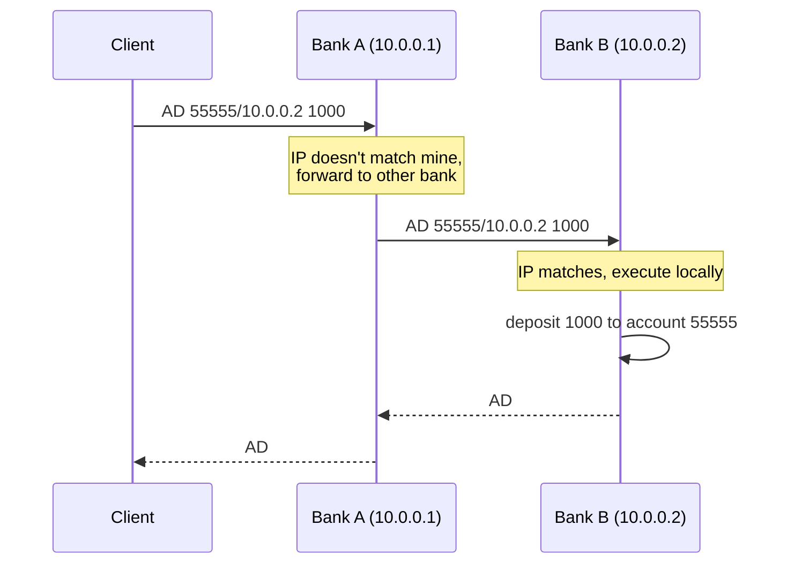
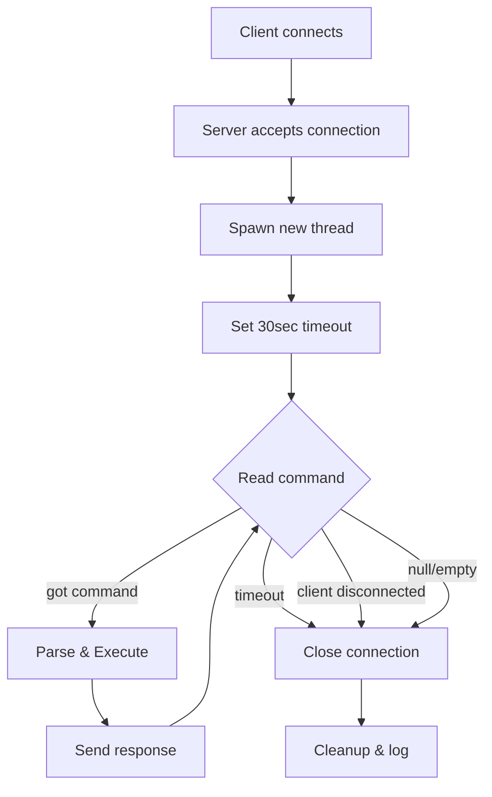
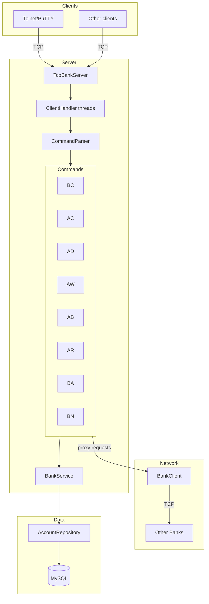
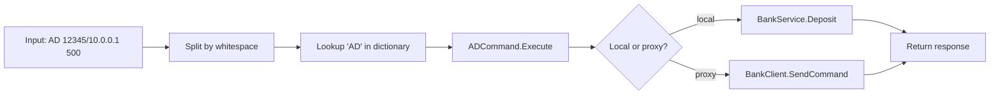
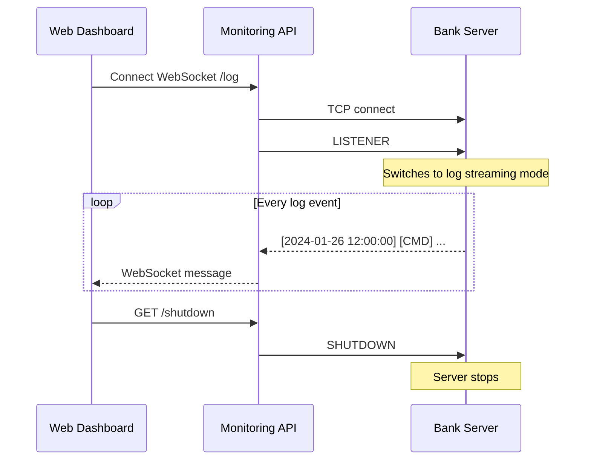
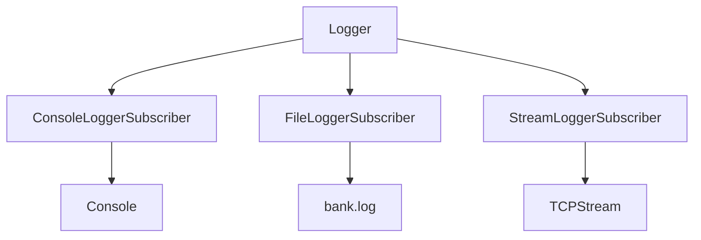

# P2P Bank Diagrams

## Proxy Flow

This is how banks talk to eachother. If you try to deposit to an account on another bank, your bank forwards the request.

## Connection Handling

What happens when a client connects to the bank server.

## Architecture

## Command Flow

How a command gets parsed and executed.

## Monitoring Flow

How the web dashboard gets logs from the bank server.

## Logger Subscriber System

The logger uses a subscriber pattern so multiple things can receive logs at the same time.

When something calls `logger.LogInfo("whatever")`, all subscribers get notified. The StreamLoggerSubscriber is used for the monitoring - it writes to the TCP stream that the API is reading from.
