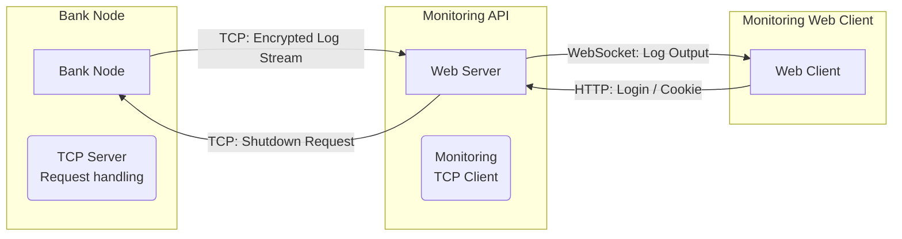

## Components

## Architecture Overview
System is split into 3 main parts

- Bank Node
    - Handles requests using a TCP server
- Web Server
    - Handles monitoring.
    - Takes data from the bank node to the web client
- Web Client
    - Frontend in React.

## Monitoring Goals
Need to see what's happening in the bank node in real-time.

1.  Log output: Stream logs from backend to frontend.
2.  Shutdown: Remote kill switch for the node.
3.  Run Info:
    - Is the node running?
    - Uptime (start date).

## Communication methods
- Security: Shared private key encryption (comes later)
- Logs: Sent over TCP with encryption.
- Methods:
    - TCP: Between bank node and web server.
    - WebSocket: Between web server and the client

## API Endpoints

| Endpoint | Type | Description |
| :--- | :--- | :--- |
| `/shutdown` | HTTP | Sends command to kill remote Bank Node. |
| `/log` | WebSocket | Opens connection for log stream. |
| `/` | HTTP | Returns main page |

---

## Implementation Specs

### Bank Server
Using Subscriber pattern for logging: (to allow for full log output abstraction)
- `ConsoleSubscriber`: Standard print to console.
- `StreamSubscriber`: Sends logs over a network stream.

### API Server
- WebSocket endpoint (/log)

### Web client
- WebSocket hook for getting information

## Iterations
1.  No Auth: Pure comms between nodes, testing data flow and logging first.
2.  With Auth: Adding security, login and cookies later.